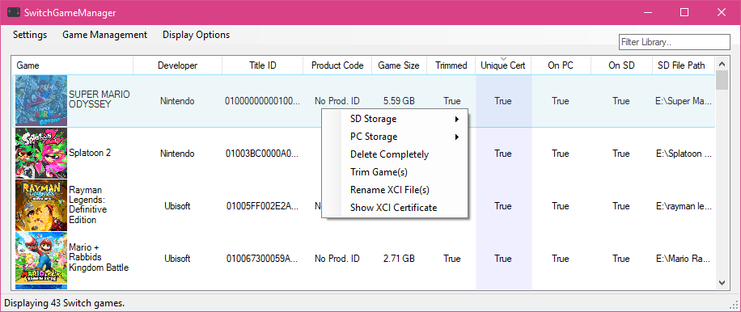
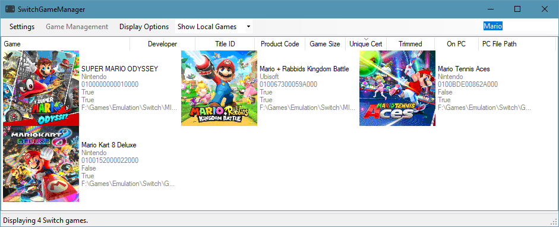
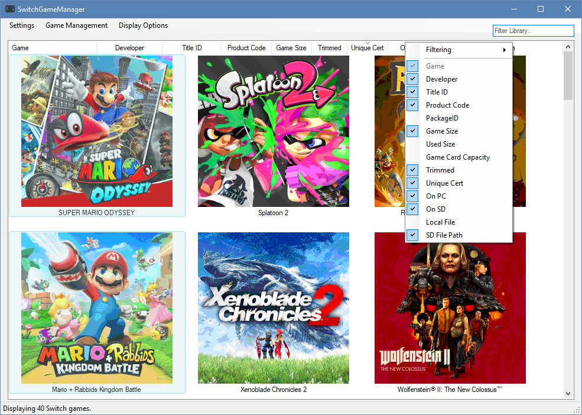
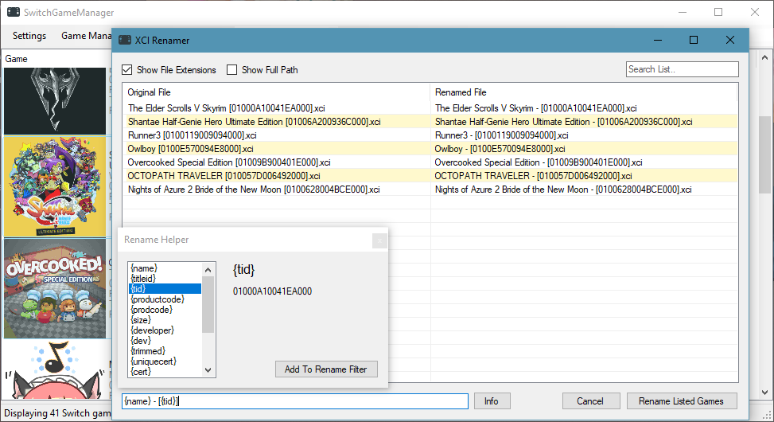

# SwitchGameManager

Updated to work with current master keys, thanks to https://github.com/StudentBlake/XCI-Explorer

Manage your XCI files on SD and PC, from multiple PC folders. Rename, search, trim, sort, copy/move/delete games.

Display your library in a few different ways, with more likely to come. For now, it relies on hacbuild to extract the PackageID of each XCI and uses that as a unique identifier, then uses the decompiled XCI-Explorer to retrieve game info.

## Important
You need a keys.txt file to use this program.
In addition to the usual keys, you'll also need **xci_header_key**!

#### Screenshots

## Bugs
- Can copy the same file(s) multiple times
- Probably some others, please report them!

## Current todo list
- [X] Make it easier to see PC or SD only games
- [X] Show SD card remaining size and other info at a glance
- [X] Prevent copying games to SD if it would exceed SD space
- [ ] Use pretty icons for games on PC/SD instead of "True" or "False"
- [ ] Move to libhac and stop using hacbuild + XCI-Explorer
- [X] Refactor most things
- [X] Do the heavy lifting in the background so the program is more responsive (loading game info)
- [ ] Better file transfer manager
- [X] Fix most bugs
- [ ] Add NSP support

### Credits
http://objectlistview.sourceforge.net/cs/index.html
https://stackoverflow.com/a/6055385
https://github.com/LucaFraga/hacbuild
https://github.com/StudentBlake/XCI-Explorer
https://www.nuget.org/packages/Be.Windows.Forms.HexBox/
Newtonsoft.Json
https://www.iconfinder.com/icons/3151574/game_nintendo_switch_video_icon
Lots of people on StackExchange/Overflow

And probably a few I'm missing.

### Donations
I worked a lot on this, but there is no fee for using it! If you appreciate my efforts, you can send a donation to any of these addresses.

 * BTC: 1QDVJmxyqMzA5nQghKMBCFVk8K41nSoz5b
 * ETH: 0xa62a11710cc44Bd54D66CbCcF710a36716BF04CE
 * Monero: 43tVLRGvcaadfw4HrkUcpEKmZd9Y841rGKvsLZW8XvEVSBX1GrGezWvQYDdoNwNHAwTqSyK7iqyyqMSpDoUVKQmM43nzT72
 * UBQ: 0x0c0ff71b06413865fe9fE9a4C40396c136a62980
 * DCR: DsfPh3tpa7nd8sExYvxWbijzjUH1zJ34dgu
 * HUSH: t1ZHrvmtgd3129iYEcFm21XMv5ojdh2xmsf
 * ZEN: znTmG8nid2LEYgw8cub17Q7briGATan4c68
 
